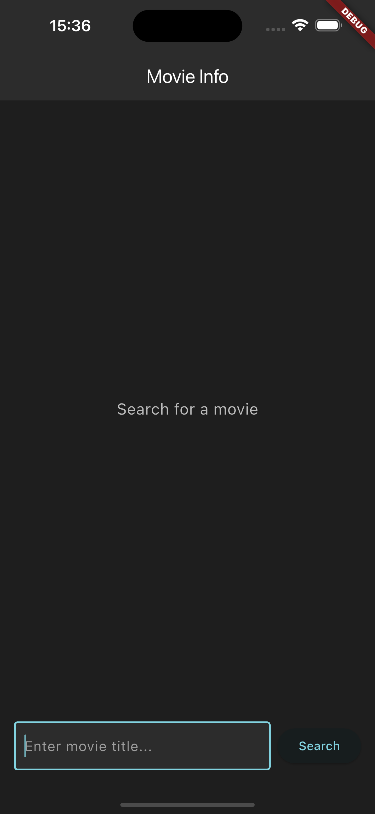
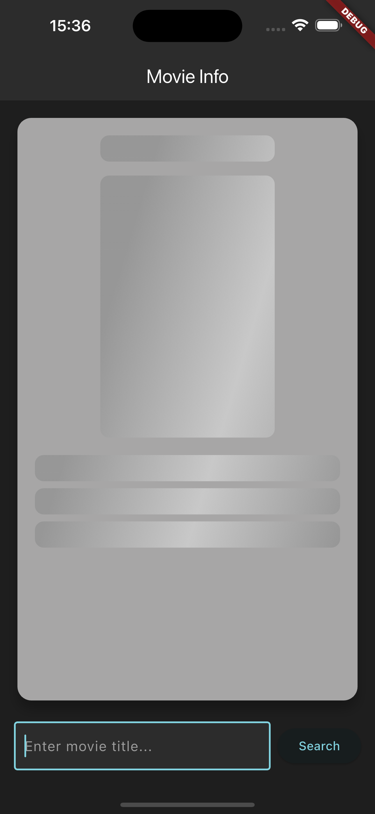
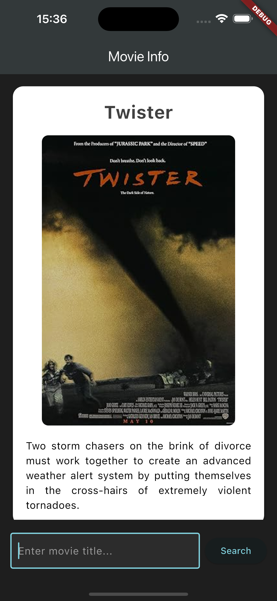

# Movie Info App

A sleek Flutter app that fetches and displays detailed movie information using the OMDb API. Built with best practices in stateful widget architecture, async data handling, and custom UI components.

## Features

- Search for any movie by title
- Displays movie title, poster, and plot
- Custom shimmer loading effect while fetching
- Dark theme with custom styling
- Uses asynchronous network calls with error handling

## Screenshots

## Tech Stack

- **Flutter** (Dart)
- **OMDb API** for movie data
- **Shimmer package** for loading animation
- **Material Design** components
- **HTTP package** for API requests

## Packages Used

- [`http`](https://pub.dev/packages/http)
- [`shimmer`](https://pub.dev/packages/shimmer)
